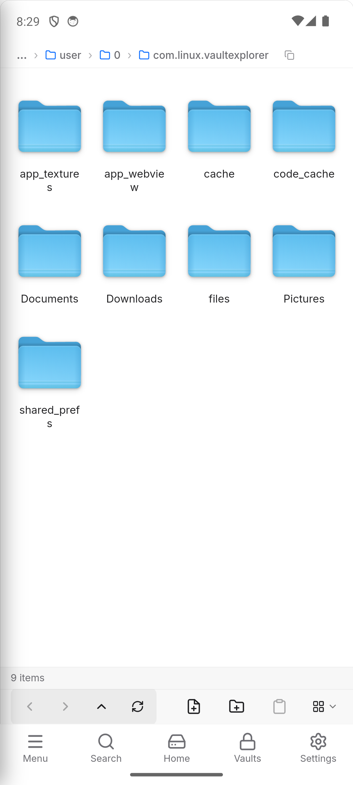
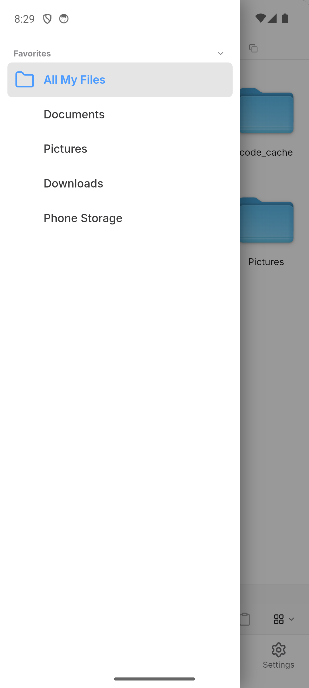
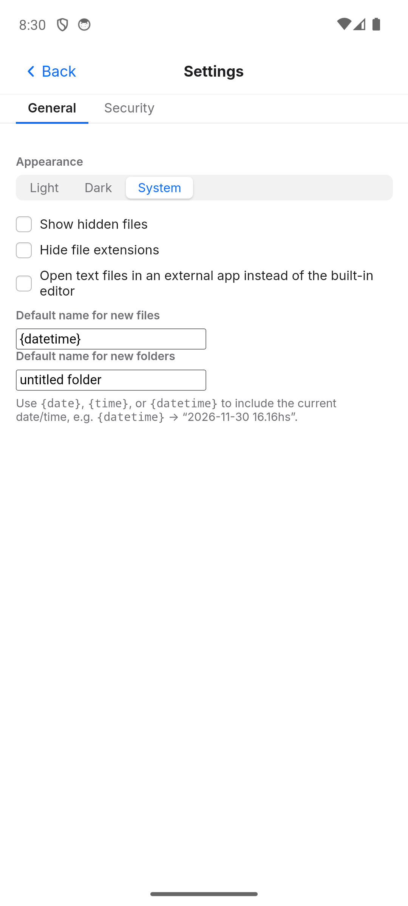

# Vault Explorer

A file manager with real encrypted vaults built in. Browse your files like any
other explorer; turn any folder into a vault and its contents are AES-GCM
encrypted at rest (filenames included), unlocked with a password (Argon2) for
as long as you're using it.

Runs on Linux desktop and Android from the same codebase (Tauri + Rust +
React).

## Features

- **Vaults**: encrypt a folder in place. Filenames, not just contents, are
  encrypted. Optional "sensitive" sub-folders that re-lock and ask for the
  password again after a timeout, independent of the vault itself.
- **File browsing**: icon/list/column views, thumbnails, tags, favorites,
  search, archive browsing (zip) without extracting first.
- **Cloud & P2P sync** (desktop only for now): Google Drive/OneDrive/Dropbox
  via `rclone`, direct device-to-device sync via a self-managed Syncthing
  instance, plain folder-to-folder sync via `unison`. Per-file "synced"
  status shown right in the file list.
- **Recovery**: exportable recovery key for a vault in case a password is
  lost.
- **Secure delete**: real overwrite-based shredding, not just unlink.
- **Freeze**: mark a folder read-only at the filesystem level.
- **Extras**: inline text/markdown editor, audio transcription, image/video
  tools, git status in the sidebar, terminal integration (desktop).
- **Mobile (Android)**: full vault browsing/encryption, in-app text editor,
  home-screen shortcuts to any folder or vault. Cloud/P2P sync isn't ported
  yet — see [Mobile scope](#mobile-scope) below.

## Screenshots

Mobile (Android):

| Browsing | Favorites | Settings |
|---|---|---|
|  |  |  |

Desktop screenshots aren't in yet -- coming once there's a safe way to grab
them without disturbing whatever's already open on a real desktop session.

## Install

Prebuilt binaries are attached to [GitHub Releases](https://github.com/lucasmoy-dev/vaultexplorer/releases/latest)
(`.apk` for Android, `.deb`/`.rpm`/`.AppImage` for desktop) -- **not**
committed into the repo itself (git isn't a great place for binaries that
change every release; a *debug* Android build alone is 500+MB). The Android
app's own Settings screen has a "Check for updates" button that reads
straight from that same latest release, downloads the APK, and hands it to
the system installer -- no separate update server. Desktop's equivalent just
opens the release page, since replacing a running desktop binary in place is
a different problem this doesn't try to solve yet.

Building from source drops its own installer/APK where noted (below); a
local `releases/` folder (already gitignored) is a convenient place to keep
the latest one handy without it ending up in git history.

## Building from source

Desktop (Linux):

```sh
cd vaultexplorer
npm install
npm run tauri build
```

Produces `.deb`/`.rpm`/`.AppImage` under
`src-tauri/target/release/bundle/`.

Android:

```sh
npm install
npm run tauri android build --debug   # or without --debug for a release build
```

Requires the Android SDK/NDK set up for Tauri mobile (see the
[Tauri mobile prerequisites](https://v2.tauri.app/start/prerequisites/#android)).
Produces an `.apk` under
`src-tauri/gen/android/app/build/outputs/apk/`.

## Mobile scope

Android has no clean way to embed the `rclone`/`syncthing`/`unison` binaries
desktop sync relies on (no shell, Play Store restrictions on bundling
arbitrary executables, and their OAuth/pairing flows assume a desktop
browser). Cloud/P2P sync on mobile needs its own design, not a straight port,
and isn't built yet. Everything else — vaults, browsing, the in-app editor,
home-screen shortcuts — works the same as desktop.

## Project layout

- `vaultexplorer/` — the app (Tauri + React frontend, Rust backend)
- `vaultcore/` — the encryption/vault library the app builds on
